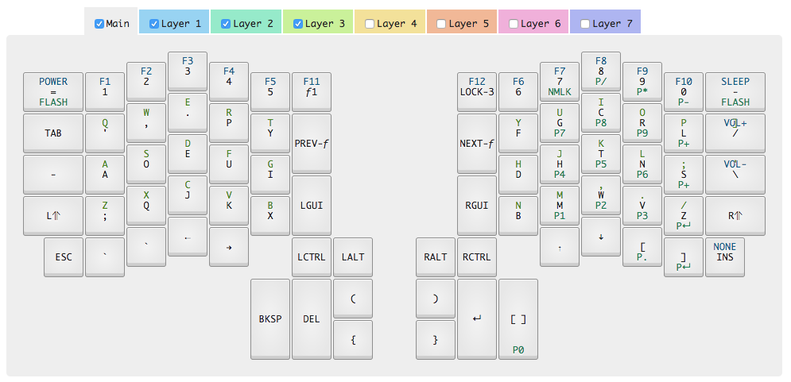

# ergodox-configuration

My key configurations for my ErgoDox Infinity keyboard.

My current setup is dvorak-based, with a qwerty option (layer 3) incase someone else wants to try to use _my_ keyboard.

The key layout looks like this: 

## How to use this keyboard configuration

The Input Club has a good description of [how to apply the key config to your IC keyboard](https://input.club/configurator-setup/).

#### TLDR;

flash the right side, then run `dfu-util -D right_kiibohd.bin`
flash the left side, then run `dfu-util -D left_kiibohd.bin`

NOTE: you'll need a 2nd keyboard to run those commands, while the ErgoDox is in _flash mode_.

## How to change the configuration

Most of the files in this repo were generated by the [Input Club's keyboard configurator](https://input.club/configurator-ergodox/).

