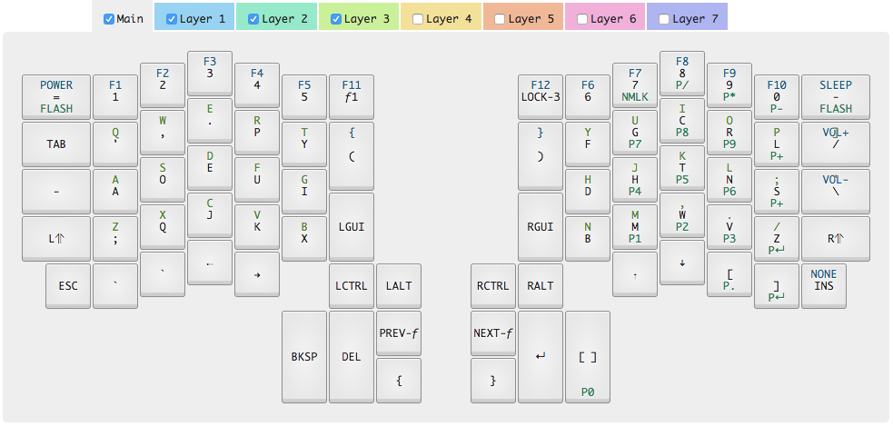

# ergodox-configuration

My key configurations for my ErgoDox Infinity keyboard.

My current setup is dvorak-based, with a qwerty option (layer 3) incase someone else wants to try to use _my_ keyboard.

The key layout looks like this: 

## How to use this keyboard configuration

The Input Club has a good description of [how to apply the key config to your IC keyboard](https://input.club/configurator-setup/).

#### TLDR;

+ flash the right side, then run `dfu-util -D right_kiibohd.bin`
+ flash the left side, then run `dfu-util -D left_kiibohd.bin`

NOTE: you'll need a 2nd keyboard to run those commands, while the ErgoDox is in _flash mode_.

## How to change the configuration

Most of the files in this repo were generated by the [Input Club's keyboard configurator](https://input.club/configurator-ergodox/).

## How to update the default image

This was surprisingly tricky to master. Turns out you need to build the firmware yourself, and change the byte array for the DefaultImage.

1. clone the [kiibohd/controller](https://github.com/kiibohd/controller) repo
2. with your bitmap (.bmp) in hand, use the [kiibohd/controller Scan/STLcd/bitmap2Struct.py](https://github.com/kiibohd/controller/blob/master/Scan/STLcd/bitmap2Struct.py) to convert your 128x32px bitmap to hexcodes.
3. in the kiibohd/controller repo, change the [Scan/Infinity_Ergodox/scancode_map.kll](https://github.com/kiibohd/controller/blob/master/Scan/Infinity_Ergodox/scancode_map.kll#L77) to replace the _STLcdDefaultImage_ with the hexcodes (from the previous step)
4. grab the build script from [kiibohd/KiiConf](https://github.com/kiibohd/KiiConf/blob/master/cgi-bin/build_layout.bash), which is the cgi script that the web configurator uses
5. run `./build_layout.bash . MDErgo1 "MDErgo1-Default-0.kll" "MDErgo1-Default-1.kll" "MDErgo1-Default-2.kll" "MDErgo1-Default-3.kll"`
6. flash the right side, then run `dfu-util -D right_kiibohd.bin`
7. flash the left side, then run `dfu-util -D left_kiibohd.bin`
